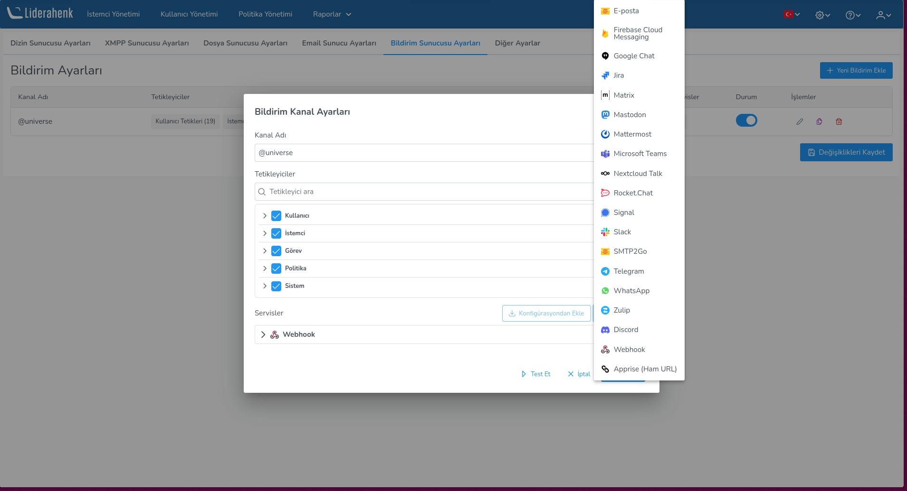
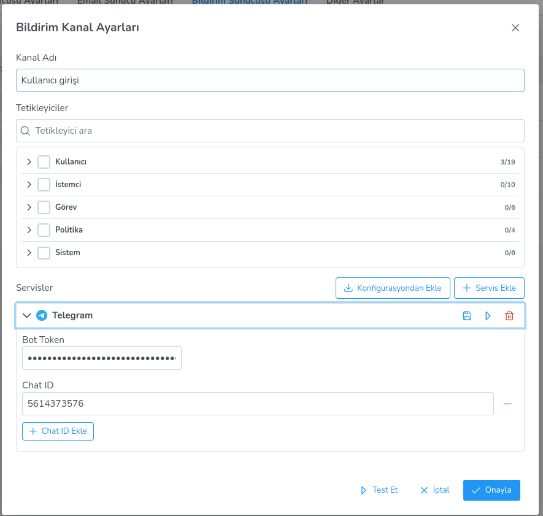
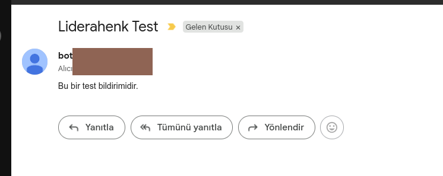

**Bildirim Servisleri**

Bildirim servisleri, bildirimlerin iletileceği hedef platformları tanımlar. Liderahenk bildirim sistemi, Apprise altyapısı sayesinde 19 farklı bildirim servisini destekler.

**Servis Ekleme**

Bir bildirim kanalını düzenlerken **Servisler** bölümünden yeni servis eklenebilir. İki yöntem mevcuttur:

- **Servis Ekle:** Açılır menüden istenen servis türü seçilir ve yapılandırma alanları doldurulur.
- **Konfigürasyondan Ekle:** Daha önce kaydedilmiş bir servis profili seçilerek hızlıca eklenir.

**Servis Yapılandırma**

Her servis türü için farklı yapılandırma alanları bulunur. Eklenen servis bir akordeon panelde görüntülenir ve ilgili alanlar doldurulur. Zorunlu alanlar yıldız (*) ile işaretlidir. Parola alanları gizli olarak gösterilir.

Bazı alanlar (örneğin alıcı listesi) tekrarlanabilirdir; satır ekle/çıkar butonlarıyla birden fazla değer girilebilir.

**Desteklenen Servisler**

| # | Servis | Açıklama | Zorunlu Alanlar |
|---|--------|----------|-----------------|
| 1 | **E-posta** | SMTP üzerinden e-posta gönderimi | Kullanıcı adı, Parola, Alan adı, Alıcı |
| 2 | **Telegram** | Telegram bot üzerinden mesaj | Bot Token, Sohbet ID'leri |
| 3 | **Slack** | Slack kanalına mesaj | Token A, Token B, Token C |
| 4 | **Discord** | Discord webhook ile mesaj | Webhook ID, Webhook Token |
| 5 | **Microsoft Teams** | Teams kanalına mesaj | Takım, Token A, Token B, Token C |
| 6 | **Google Chat** | Google Workspace sohbet | Workspace, Webhook Key, Webhook Token |
| 7 | **Mattermost** | Mattermost kanalına mesaj | Hostname, Token |
| 8 | **Rocket.Chat** | Rocket.Chat kanalına mesaj | Hostname, Hedefler |
| 9 | **Matrix** | Matrix odasına mesaj | Kullanıcı, Parola, Hostname, Oda Takma Adı |
| 10 | **Signal** | Signal mesajı | Kullanıcı, Parola, Hostname, Gönderen Telefon |
| 11 | **WhatsApp** | WhatsApp Business API mesajı | Token, Gönderen Telefon ID, Hedefler |
| 12 | **Mastodon** | Mastodon paylaşımı | Token, Host |
| 13 | **Nextcloud Talk** | Nextcloud Talk mesajı | Kullanıcı, Parola, Hostname, Oda ID |
| 14 | **Zulip** | Zulip mesajı | Bot Adı, Organizasyon, Token |
| 15 | **Jira** | Jira bildirimi | API Key |
| 16 | **Firebase Cloud Messaging** | FCM push bildirimi | API Key, Cihazlar |
| 17 | **SMTP2Go** | SMTP2Go e-posta servisi | Kullanıcı, Alan adı, API Key, Alıcı |
| 18 | **Webhook** | Herhangi bir HTTP uç noktasına POST | URL |
| 19 | **Apprise (Ham URL)** | Doğrudan Apprise URL formatı | URL |

**Servis Testi**

Her servisin başlık çubuğunda bulunan **test** butonuna (▶) tıklayarak ilgili servise test bildirimi gönderilebilir. Test sonucu başarılı veya başarısız olarak bildirilir.

Ayrıca kanal penceresinin alt kısmındaki **Test Et** butonuyla kanala bağlı tüm servisler aynı anda test edilebilir. Sonuçlar bir bildirim mesajıyla özetlenir.

**Servis Profili Kaydetme**

Yapılandırılmış bir servisi profil olarak kaydetmek için servis başlık çubuğundaki **kaydet** simgesine (💾) tıklanır. Açılan pencerede profile bir ad verilir ve kaydedilir.

Kaydedilen profiller, diğer kanallara servis eklerken **Konfigürasyondan Ekle** seçeneği ile tekrar kullanılabilir. Bu sayede aynı servis yapılandırmasını birden fazla kanalda tekrar girmek gerekmez.

**Servis Silme**

Bir servisi kanaldan kaldırmak için servis başlık çubuğundaki **sil** butonuna (🗑) tıklanır.

<link href=/lider3.0/assets/style.css rel=stylesheet></link>
