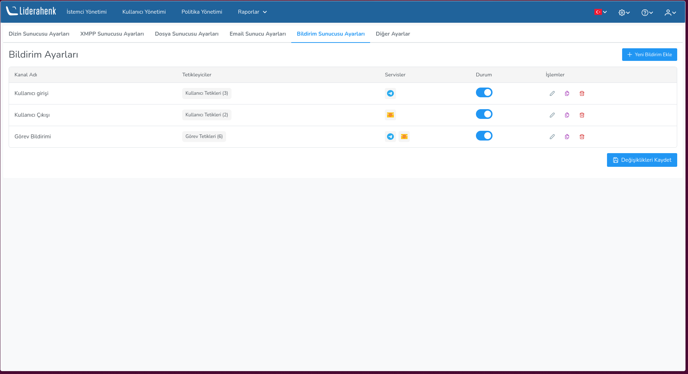
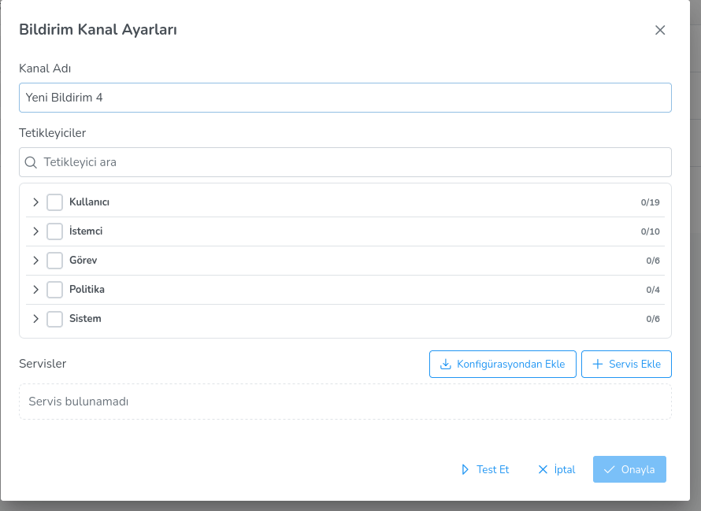

**Bildirim Ayarları**

Liderahenk bildirim sistemi, sunucu üzerinde gerçekleşen olayları (görev yürütme, kullanıcı girişi, ahenk kaydı vb.) dış bildirim kanallarına ileten bir altyapıdır. Bu altyapı sayesinde yöneticiler, sistemde meydana gelen önemli değişikliklerden anlık olarak haberdar olabilir.

Sistem, arka planda **Apprise** bildirim ağ geçidini kullanarak 19 farklı bildirim servisine (Telegram, E-posta, Slack, Discord, Microsoft Teams vb.) mesaj gönderebilir.

**Temel Kavramlar**

Bildirim sistemi üç temel bileşenden oluşur:

- **Kanal:** Bir veya daha fazla tetikleyici ile bir veya daha fazla bildirim servisini bir araya getiren yapıdır. Örneğin "Güvenlik Bildirimleri" adlı bir kanal; başarısız giriş, kullanıcı silme gibi tetikleyicileri Telegram ve E-posta servislerine bağlayabilir.

- **Tetikleyici:** Sistemde meydana gelen ve bildirim gönderilmesini başlatan olaylardır. 5 alan altında toplam 41 tetikleyici tanımlıdır: Kullanıcı, İstemci, Görev, Politika ve Sistem.

- **Servis:** Bildirimin iletileceği hedef platformdur. Telegram, E-posta, Slack, Discord gibi 19 farklı servis desteklenir.

**Bildirim Ayarları Ekranı**

Bildirim ayarlarına **Ayarlar → Sunucu Ayarları → Bildirim Ayarları** sekmesinden erişilir.

Bu ekranda tanımlı bildirim kanalları bir tablo halinde listelenir. Tabloda her kanal için aşağıdaki bilgiler görüntülenir:

| Sütun | Açıklama |
|-------|----------|
| **Kanal Adı** | Kanalın görünen adı |
| **Tetikleyiciler** | Kanala bağlı tetikleyiciler, alan adına göre gruplandırılmış olarak gösterilir |
| **Servisler** | Kanala bağlı bildirim servisleri simge olarak gösterilir |
| **Durum** | Kanalı açıp kapatmak için kullanılan anahtar |
| **İşlemler** | Düzenle, Kopyala ve Sil butonları |

**Yeni Kanal Ekleme**

Sağ üstteki **Yeni Bildirim Ekle** butonuna tıklayarak yeni bir bildirim kanalı oluşturabilirsiniz. Açılan pencerede:

1. **Kanal adı** belirlenir
2. **Tetikleyiciler** seçilir (hangi olaylarda bildirim gönderileceği)
3. **Servisler** eklenir (bildirimin hangi platformlara iletileceği)

Detaylı bilgi için [Bildirim Servisleri](notificationServices.md) ve [Bildirim Tetikleyicileri](notificationTriggers.md) sayfalarına bakınız.

**Kanal İşlemleri**

- **Düzenle** (kalem simgesi): Kanalın adını, tetikleyicilerini ve servislerini değiştirmek için kullanılır.
- **Kopyala** (kopya simgesi): Mevcut kanalın bir kopyasını oluşturur. Kopyalanan kanalın adına "(Kopya)" eklenir.
- **Sil** (çöp kutusu simgesi): Kanalı siler.
- **Durum anahtarı**: Kanalı geçici olarak devre dışı bırakmak veya tekrar etkinleştirmek için kullanılır.

Değişikliklerin kalıcı olması için sayfanın altındaki **Kaydet** butonuna tıklanmalıdır. Kaydetme işlemi sırasında bir onay penceresi görüntülenir.

**Ön Gereksinimler**

Bildirim sisteminin çalışabilmesi için sunucuda **Apprise API** servisinin kurulu ve çalışır durumda olması gerekmektedir. Varsayılan olarak Apprise API `http://localhost:8000` adresinde çalışır. Kurulum için Liderahenk kurulum aracındaki (lider-ahenk-installer) ilgili seçenek kullanılabilir.

<link href=/lider3.0/assets/style.css rel=stylesheet></link>
