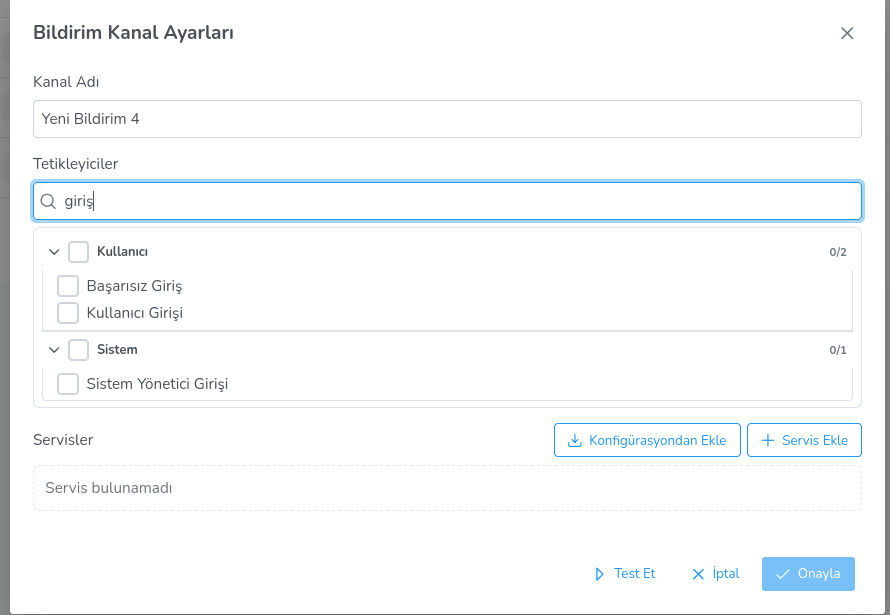

**Bildirim Tetikleyicileri**

Tetikleyiciler, sistemde meydana gelen ve bildirim gönderilmesini başlatan olaylardır. Her tetikleyici bir alana (domain) aittir ve bir önem derecesine sahiptir. Bir bildirim kanalına istenen tetikleyiciler atanarak hangi olaylarda bildirim gönderileceği belirlenir.

**Tetikleyici Seçimi**

Bir bildirim kanalını düzenlerken **Tetikleyiciler** bölümünde tüm tetikleyiciler alanlarına göre gruplandırılmış olarak listelenir. Her bir grubun yanındaki onay kutusu ile gruptaki tüm tetikleyiciler topluca seçilebilir veya kaldırılabilir.

Tetikleyiciler arasında arama yapmak için bölümün üstündeki arama çubuğu kullanılabilir.

**Kullanıcı Tetikleyicileri**

Kullanıcı hesapları, oturumları ve gruplarıyla ilgili olayları kapsar.

| Tetikleyici | Açıklama | Önem |
|-------------|----------|------|
| Kullanıcı Girişi | Bir kullanıcı Lider konsoluna giriş yaptığında | Bilgi |
| Kullanıcı Çıkışı | Bir kullanıcı Lider konsolundan çıkış yaptığında | Bilgi |
| Başarısız Giriş | Başarısız bir giriş denemesi gerçekleştiğinde | Uyarı |
| Kullanıcı Oluşturuldu | Yeni bir kullanıcı hesabı oluşturulduğunda | Bilgi |
| Kullanıcı Güncellendi | Bir kullanıcı hesabı güncellendiğinde | Bilgi |
| Kullanıcı Silindi | Bir kullanıcı hesabı silindiğinde | Uyarı |
| Kullanıcı Taşındı | Bir kullanıcı farklı bir organizasyon birimine taşındığında | Bilgi |
| Kullanıcı Parolası Değiştirildi | Bir kullanıcının parolası değiştirildiğinde | Uyarı |
| Kullanıcı Parolası Sıfırlandı | Parola unutma işlemi ile parola sıfırlandığında | Uyarı |
| Kullanıcı Oturum Açtı (İstemci) | Bir kullanıcı istemci makinede oturum açtığında | Bilgi |
| Kullanıcı Oturumu Kapattı (İstemci) | Bir kullanıcı istemci makinede oturumu kapattığında | Bilgi |
| Kullanıcı Grubu Oluşturuldu | Yeni bir kullanıcı grubu oluşturulduğunda | Bilgi |
| Kullanıcı Grubu Silindi | Bir kullanıcı grubu silindiğinde | Uyarı |
| Kullanıcı Grubu Taşındı | Bir kullanıcı grubu farklı bir konuma taşındığında | Bilgi |
| AD Kullanıcısı Oluşturuldu | Active Directory'den bir kullanıcı senkronize edildiğinde | Bilgi |
| AD Kullanıcısı Silindi | Active Directory'den senkronize edilmiş bir kullanıcı silindiğinde | Uyarı |
| AD Kullanıcı Parolası Değiştirildi | AD kullanıcısının parolası değiştirildiğinde | Uyarı |

**İstemci (Ahenk) Tetikleyicileri**

Ahenk istemcileri, istemci grupları ve organizasyon birimleriyle ilgili olayları kapsar.

| Tetikleyici | Açıklama | Önem |
|-------------|----------|------|
| Ahenk Kayıt Oldu | Yeni bir ahenk istemcisi sisteme kayıt olduğunda | Bilgi |
| Ahenk Kaydı Silindi | Bir ahenk istemcisinin kaydı silindiğinde | Uyarı |
| Ahenk Çevrimiçi | Bir ahenk istemcisi çevrimiçi olduğunda | Bilgi |
| Ahenk Çevrimdışı | Bir ahenk istemcisi çevrimdışı olduğunda | Bilgi |
| İstemci Organizasyon Birimi Oluşturuldu | Yeni bir istemci organizasyon birimi oluşturulduğunda | Bilgi |
| İstemci Organizasyon Birimi Silindi | Bir istemci organizasyon birimi silindiğinde | Uyarı |
| İstemci Grubu Oluşturuldu | Yeni bir istemci grubu oluşturulduğunda | Bilgi |
| İstemci Grubu Güncellendi | Bir istemci grubunun bilgileri güncellendiğinde | Bilgi |
| İstemci Grubu Silindi | Bir istemci grubu silindiğinde | Uyarı |
| İstemci Grubu Taşındı | Bir istemci grubu farklı bir konuma taşındığında | Bilgi |

**Görev Tetikleyicileri**

Görev yürütme ve zamanlanmış görevlerle ilgili olayları kapsar.

| Tetikleyici | Açıklama | Önem |
|-------------|----------|------|
| Görev Gönderildi | Bir görev istemcilere gönderildiğinde | Bilgi |
| Ahenk Başarısız Görev Çıktısı | Bir ahenk görev yürütmesinde hata bildirdiğinde | Hata |
| Görev Tamamlandı | Bir görev başarıyla tamamlandığında | Bilgi |
| Zamanlanmış Görev Oluşturuldu | Yeni bir zamanlanmış görev tanımlandığında | Bilgi |
| Zamanlanmış Görev Güncellendi | Bir zamanlanmış görev güncellendiğinde | Bilgi |
| Zamanlanmış Görev İptal Edildi | Bir zamanlanmış görev iptal edildiğinde | Uyarı |

**Politika Tetikleyicileri**

Politika uygulamaları ve politika istisnalarıyla ilgili olayları kapsar.

| Tetikleyici | Açıklama | Önem |
|-------------|----------|------|
| Politika Uygulandı | Bir politika istemcilere veya kullanıcılara uygulandığında | Bilgi |
| Politika Kaldırıldı | Bir politika ataması kaldırıldığında | Uyarı |
| Politika İstisnası Oluşturuldu | Bir politika istisnası tanımlandığında | Bilgi |
| Politika İstisnası Silindi | Bir politika istisnası kaldırıldığında | Uyarı |

**Sistem Tetikleyicileri**

Lider sunucusu ve konsol kullanıcılarıyla ilgili olayları kapsar.

| Tetikleyici | Açıklama | Önem |
|-------------|----------|------|
| Lider Kullanıcı Parolası Değiştirildi | Bir Lider konsol kullanıcısının parolası değiştirildiğinde | Uyarı |
| Lider Kullanıcı Güncellendi | Bir Lider konsol kullanıcısının bilgileri güncellendiğinde | Bilgi |
| Sunucu Eklendi | Ayarlara yeni bir sunucu tanımı eklendiğinde | Bilgi |
| Sunucu Silindi | Ayarlardan bir sunucu tanımı silindiğinde | Uyarı |

**Önem Dereceleri**

Tetikleyiciler üç önem derecesine sahiptir:

- **Bilgi (INFO):** Normal işleyişteki olaylar (kullanıcı girişi, görev gönderimi vb.)
- **Uyarı (WARNING):** Dikkat gerektiren olaylar (silme işlemleri, parola değişiklikleri vb.)
- **Hata (ERROR):** Başarısız işlemler (görev yürütme hatası vb.)

<link href=/lider3.0/assets/style.css rel=stylesheet></link>
