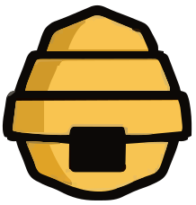
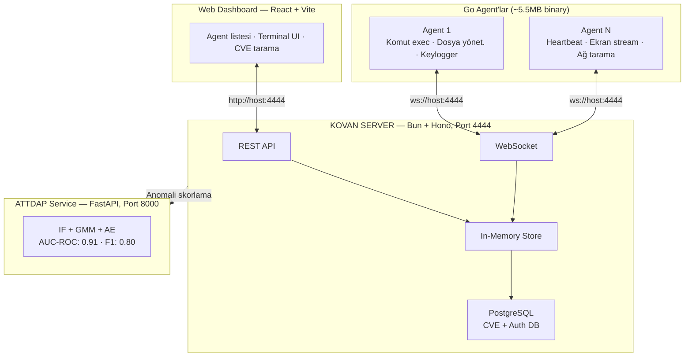

<p align="center">
  
</p>

<h1 align="center">KOVAN</h1>

<p align="center">
  <strong>Pardus Tabanlı Uç Nokta Güvenlik & Yönetim Platformu</strong>
</p>

<p align="center">
  <a href="#kurulum"></a>
  <a href="#"></a>
  <a href="#"></a>
  <a href="#"></a>
</p>

<p align="center">
  Ağ cihazlarınızı tek panelden yönetin, güvenlik açıklarını tarayın,<br/>
  ML tabanlı anomali tespiti yapın ve tehditlere anında müdahale edin.
</p>

---

https://github.com/user-attachments/assets/7c45cd16-4190-4d2b-9f53-969f922ca16a


## Problem

Kamu kurumları ve işletmeler, uç nokta güvenliğinde ciddi sorunlarla karşı karşıya:

| Problem | Açıklama |
|---------|----------|
| **Dağınık Cihaz Yönetimi** | Yüzlerce uç nokta farklı araçlarla yönetiliyor, merkezi görünürlük yok |
| **Zafiyet Takip Eksikliği** | CVE veritabanları takip edilmiyor, kurulu paketlerdeki açıklar tespit edilemiyor |
| **Ağ Anomali Tespiti** | Anormal ağ trafiği manuel süreçlerle tespit ediliyor, müdahale geç kalıyor |
| **Yetki & Erişim Kontrolü** | Rol tabanlı yetkilendirme çoğu çözümde bulunmuyor |
| **Tehdit Görünürlüğü** | Saldırı yüzeyleri bilinmiyor, tehditler algılanamıyor |

> Türkiye'de siber saldırılar **%68 artış** gösterdi (2024-2025). Ortalama veri ihlali tespit süresi **207 gün**, maliyeti **$4.45M** (IBM 2024).

---

## Kovan Nedir?

**Kovan**, Pardus ve Debian tabanlı sistemler için geliştirilmiş açık kaynak bir **uç nokta güvenlik ve yönetim platformu**dur. Merkezi bir panelden tüm cihazlarınızı yönetmenizi, güvenlik açıklarını taramanızı ve ağ anomalilerini tespit etmenizi sağlar.

### Temel Yetenekler

<table>
  <tr>
    <td width="50%">

**Uzaktan Komut Yönetimi**
Agent'lara terminal üzerinden anlık komut gönderin, çıktıları gerçek zamanlı izleyin. İnteraktif PTY desteği.

**CVE Zafiyet Taraması**
47.000+ CVE kaydı ile kurulu paketleri karşılaştırın. `dpkg` entegrasyonu, fuzzy search desteği.

**ATTDAP Anomali Tespiti**
ML tabanlı 3 model ensemble (IF + GMM + Autoencoder) ile ağ trafiğini analiz edin.

**Dosya Yöneticisi**
Uzak cihaz dosya sistemi üzerinde gezinin, dosya indirin/yükleyin/silin.

</td>
<td width="50%">

**Ağ Keşfi & Tarama**
Yerel ağdaki cihazları otomatik keşfedin, açık portları ve servisleri haritalayın.

**Zamanlanmış Görevler**
Cron tabanlı otomatik komut çalıştırma. Tekil veya grup bazlı hedefleme.

**Ekran & Tuş İzleme**
Gerçek zamanlı ekran akışı (ffmpeg/PowerShell). Keylogger desteği — red team senaryoları için.

**Grup Broadcast**
Agent'ları gruplara ayırın, tek komutla tüm gruba toplu komut gönderin.

</td>
  </tr>
</table>

### Ek Özellikler

- **Rol Tabanlı Erişim (RBAC)** — Admin/kullanıcı rolleri, agent bazlı yetkilendirme
- **Sistem Metrikleri** — CPU, RAM, Disk, GPU kullanımı, uptime (gerçek zamanlı grafikler)
- **GeoIP Harita** — Agent'ların coğrafi konumu dünya haritası üzerinde
- **Alert Engine & Telegram** — Metrik eşik aşımı, agent çevrimdışı → otomatik bildirim
- **Donanım Parmak İzi** — machineId, MAC, CPU model ile kalıcı agent tanıma
- **Cross-Platform** — Windows + Linux (Pardus/Debian), otomatik OS algılama

---

## Mimari



---

## Hızlı Başlangıç

### Gereksinimler

- [Bun](https://bun.sh) v1.0+
- [Go](https://go.dev) 1.21+ (agent derlemesi için)
- [PostgreSQL](https://www.postgresql.org/) 15+ (CVE + Auth veritabanı)
- [Python](https://www.python.org/) 3.10+ (anomali modeli için, opsiyonel)
- [pnpm](https://pnpm.io/) (paket yönetimi)

### 1. Veritabanı Kurulumu

```bash
# PostgreSQL'de kovan veritabanını oluşturun
createdb -U postgres kovan

# Auth tablolarını oluşturun
cd server
psql -U postgres -d kovan -f scripts/init-auth.sql
psql -U postgres -d kovan -f scripts/init-permissions.sql
pnpm run db:seed

# CVE tablolarını oluşturun ve verileri yükleyin
pnpm run db:init
pnpm run db:import    # ~47K CVE, ~32 saniye
```

### 2. Server

```bash
cd server
pnpm install
pnpm run dev
```

Server `http://0.0.0.0:4444` adresinde başlar. REST API, WebSocket ve frontend hepsi tek portta çalışır.

### 3. Frontend (Geliştirme)

```bash
cd frontend
pnpm install
pnpm run dev
```

Dashboard `http://localhost:5173` adresinde açılır (API proxy aktif).

### 4. Frontend (Production)

```bash
cd frontend
pnpm run build
```

Build çıktısı `frontend/dist/` klasörüne oluşur. Server otomatik olarak serve eder.

### 5. Go Agent

```bash
cd client-go

# Derleme
go build -ldflags="-s -w" -o kovan-agent .

# Çalıştırma (varsayılan: localhost)
./kovan-agent

# Uzak sunucuya bağlanma
./kovan-agent --server ws://SUNUCU_IP:4444/ws/agent

# Env ile bağlanma
C2_SERVER=ws://SUNUCU_IP:4444/ws/agent ./kovan-agent

# Daemon olarak kurma (Linux: systemd, Windows: Scheduled Task)
sudo ./kovan-agent install --server ws://SUNUCU_IP:4444/ws/agent
```

#### Cross-Compilation

```bash
cd client-go
make linux      # Linux AMD64 (Pardus)
make windows    # Windows AMD64
make all        # Tüm platformlar
```

### 6. ATTDAP Anomali Servisi (Opsiyonel)

```bash
cd anomaly-model
python3 -m venv .venv && source .venv/bin/activate
pip install -r requirements.txt

# Veri setlerini indir
python -m data.download_datasets

# Modelleri eğit
python -m pipeline.train

# API'yi başlat
uvicorn api.main:app --host 0.0.0.0 --port 8000 --reload
```

---

## API Referansı

### REST API (Port 4444)

| Method | Endpoint | Açıklama | Auth |
|--------|----------|----------|------|
| `GET` | `/api/health` | Sağlık kontrolü | Hayır |
| `GET` | `/api/agents` | Tüm agent'ları listele | Evet |
| `GET` | `/api/agents/:id` | Agent detayı | Evet |
| `PATCH` | `/api/agents/:id` | Agent alias güncelle | Evet |
| `DELETE` | `/api/agents/:id` | Agent sil | Admin |
| `GET` | `/api/agents/:id/commands` | Agent komut geçmişi | Evet |
| `DELETE` | `/api/agents/:id/commands` | Komut geçmişini temizle | Evet |
| `POST` | `/api/command` | Komut gönder | Evet |
| `GET` | `/api/commands` | Tüm komutlar | Evet |
| `GET` | `/api/cves/stats` | CVE istatistikleri | Hayır |
| `GET` | `/api/cves/search?q=openssl` | CVE arama | Hayır |
| `GET` | `/api/cves/:id` | CVE detayı | Hayır |
| `POST` | `/api/cves/scan` | Paket zafiyet taraması | Hayır |
| `GET/POST/DELETE` | `/api/permissions` | Agent yetkileri | Admin |

### WebSocket (`/ws/agent`)

| Mesaj | Yön | Açıklama |
|-------|-----|----------|
| `register` | Agent → Server | İlk kayıt (hostname, os, username, ip) |
| `registered` | Server → Agent | Kayıt onayı (agentId) |
| `heartbeat` | Agent → Server | Canlılık sinyali (10sn aralık) |
| `command` | Server → Agent | Çalıştırılacak komut |
| `result` | Agent → Server | Komut çıktısı (stdout/stderr) |

### ATTDAP API (Port 8000)

| Method | Endpoint | Açıklama |
|--------|----------|----------|
| `GET` | `/health` | Servis durumu + model bilgisi |
| `POST` | `/score` | Tek ağ akışı skorlama |
| `POST` | `/batch-score` | Toplu skorlama (max 10K event) |
| `GET` | `/model-info` | Model config, metrikler, feature listesi |

---

## ATTDAP — Anomali Tespit Modülü

**ATTDAP** (Anomaly Traffic Detection & Analysis Platform), ML tabanlı ağ trafiği anomali tespit modülüdür.

| Metrik | Değer |
|--------|-------|
| **F1 Score** | 0.7995 |
| **AUC-ROC** | 0.9088 |
| **Precision** | 0.8836 |
| **Recall** | 0.7300 |

- **3 Model Ensemble:** Isolation Forest (0.10 ağırlık) + GMM (0.90 ağırlık) + Denoising Autoencoder
- **Eğitim Verileri:** CICIDS2017 + UNSW-NB15 (26 ortak ağ akışı özelliği)
- **Çıktı:** 0-100 arası hibrit risk skoru
- **Risk Seviyeleri:** Düşük (<79) · Orta (<50) · Yüksek (<75) · Kritik (≥75)

---

## Teknoloji Stack'i

| Katman | Teknolojiler |
|--------|-------------|
| **Backend** | Bun · Hono · TypeScript · WebSocket · Better Auth |
| **Frontend** | React · Vite · TypeScript · Zustand |
| **Agent** | Go (~5.5MB binary) · Cross-platform · Daemon installer |
| **Veritabanı** | PostgreSQL · TimescaleDB (zaman serisi) |
| **ML Pipeline** | Python · PyTorch · scikit-learn · FastAPI |
| **Araçlar** | ffmpeg (ekran yakalama) · pnpm · Makefile |

---

## Takım

| İsim | Rol |
|------|-----|
| **Barış Cem Bayburtlu** | Full-Stack / Takım Lideri |
| **Batuhan Bayazıt** | Backend / DevOps |
| **Burak Aydoğmuş** | Go Agent / Sistem |
| **Mustafa Yusuf Onur** | Frontend / UX |
| **Mehmet Ali Selvet** | ML / Anomali Modeli |

---

## Varsayılan Giriş Bilgileri

| Hesap | E-posta | Şifre |
|-------|---------|-------|
| Admin | `admin@admin.com` | `admin123` |

---

## Testler

```bash
cd server
bun test
```

15 test: REST API (health, agents, commands, 404, 400) + WebSocket (register, heartbeat, offline, send/receive commands, errors, multi-command).

---

## Uyarı

> **Bu proje yalnızca eğitim ve demo amaçlıdır.** Yetkisiz sistemlerde kullanımı yasalara aykırıdır. Tüm sorumluluk kullanıcıya aittir.

---

## Lisans

MIT License — Detaylar için [LICENSE](LICENSE) dosyasına bakın.

---

<p align="center">
  
  <br/>
  <sub>HackMETU 2026 — Wired Takımı</sub>
</p>
